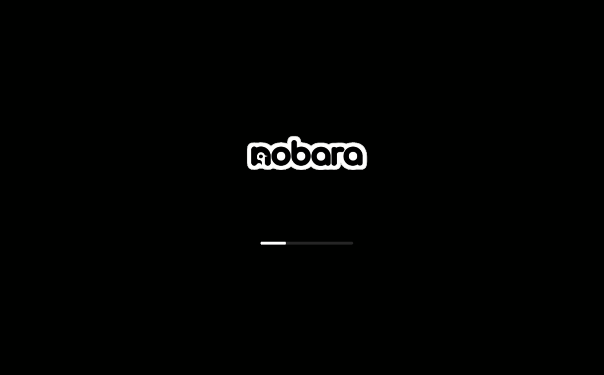

# Nobara Logo Plymouth Theme



This is a custom, modern Plymouth boot theme for Nobara Linux.

## Links
- **KDE Store:** [https://store.kde.org/p/2030068](https://store.kde.org/p/2342409)

## Credits
This project is a **rebranded modification** of the original [macOS Plymouth theme](https://store.kde.org/p/2030068) created by **Lozano Juan Pablo**.

Special thanks to the original author for the script logic!

## Changes in this version
- Replaced all macOS branding with Nobara Linux logos.
- Optimized script for Nobara's default resolution.
- Renamed all internal references for a clean install.

## Installation
1. Move the `nobara-logo` folder to `/usr/share/plymouth/themes/`
2. Set it as default:
   ```bash
   sudo plymouth-set-default-theme -R nobara-logo
